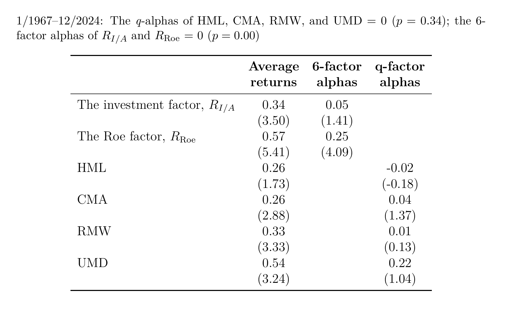

# Replication of Fama-French, Hou-Xue-Zhang Factors and Spanning Regression Table

This repository replicates the **monthly return** versions of the Fama-French (1992, 2015, 2018) and Hou-Xue-Zhang (2015, 2020) asset pricing factors using **CRSP** and **Compustat** data.

It includes:

- Factor replication for market (MKT-RF), size (SMB), value (HML), profitability (RMW), investment (CMA), momentum (UMD), and q-factors (ME, I/A, ROE).
- A full reproduction of the **spanning regression** table from [global-q.org](https://global-q.org/index.html), including **average return, alphas, GRS test**.
- Modular, documented, and reproducible code written in **Python**.

---

## Repository Structure

- **`Test.py` or `Main.py`**  
  The main script. It runs the complete pipeline: importing data, constructing Fama-French and q-factors, and reproducing the spanning regression table.
  See `Test.py` for code modification history.

- **`Data_preprocess.py`**  
  Handles preprocessing of Compustat annual/quarterly fundamentals, CRSP returns, and the CRSP/Compustat Merged (CCM) link table. It computes necessary sorting variables and aligns timing across datasets.

- **`Procedure_functions.py`**  
  Contains reusable functions for:
  - Portfolio sorting by quantiles
  - Value-weighted
  - GRS test
  - ...

- **`/data`**  
  Contains benchmark data from [Ken French Data Library](https://mba.tuck.dartmouth.edu/pages/faculty/ken.french/data_library.html) and [global-q.org](https://global-q.org/index.html) for validation and comparison.

- **`/master`**
  `/Factors_monthly.csv` contains **replicated Fama-French 6 factors and q-factors**.
  `Factor_sharpe_ratios.csv` contains the factors' **annualised return, annualised volatility and Sharpe Ratio**.

- The file **[`Report - Replication of Fama-French, Hou-Xue-Zhang Factors and Spanning Regression Table.pdf`]** contains the **final written report** for this assignment. It summarizes the methodology of factor construction and insights into the spanning regression results.

---

## Methodology Summary

This replication follows the methodology outlined in:
- **Fama and French (1992, 1993, 2015, 2018)** for MKT-RF, SMB, HML, RMW, CMA, UMD
- **Hou, Xue, and Zhang (2015, 2020)** for ME, I/A, ROE

---

## Comparison with Benchmark Factors

To verify the validity of the replication pipeline, the constructed factors are correlated with benchmark factors from the **Ken French Data Library** and **global-q.org**.

| Constructed Factor | Benchmark         | Correlation |
|--------------------|-------------------|-------------|
| MKT-RF             | Fama-French MKT-RF| 0.9996      |
| SMB_O              | Fama-French SMB   | 0.9980      |
| HML                | Fama-French HML   | 0.9829      |
| RMW_O              | Fama-French RMW   | 0.9828      |
| CMA                | Fama-French CMA   | 0.9952      |
| UMD                | Fama-French UMD   | 0.9756      |
| R_ME               | HXZ R_ME            | 0.9947      |
| R_IA               | HXZ R_IA            | 0.9797      |
| R_ROE              | HXZ R_ROE           | 0.9837      |

Although the correlations are **extremely high**, my replicated factor time series only covers **1971 to 2024**, due to **missing accounting data** (after supplement and imputation as Hou-Xue-Zhang (2025) technical documentation) in earlier periods affecting q-factor construction.

**Spanning Regression**

`latex_table/Tables.pdf` is the spanning regression results and GRS tests:

Comparison figure from [global-q.org](https://global-q.org):

**Sharpe Ratio**

| Factor  | Annualized Return (%) | Annualized Volatility (%) | Sharpe Ratio |
|---------|------------------------|----------------------------|---------------|
| MKT_RF  | 7.51                   | 15.78                      | 0.48          |
| HML     | 3.07                   | 10.85                      | 0.28          |
| SMB_O   | 1.72                   | 10.65                      | 0.16          |
| RMW_O   | 3.97                   | 7.85                       | 0.51          |
| CMA     | 3.16                   | 7.01                       | 0.45          |
| UMD     | 6.48                   | 14.21                      | 0.46          |
| R_ME    | 2.64                   | 10.82                      | 0.24          |
| R_IA    | 4.09                   | 7.43                       | 0.55          |
| R_ROE   | 6.85                   | 9.12                       | 0.75          |

---

## Reference:
- Ball, R., Gerakos, J., Linnainmaa, J. T., & Nikolaev, V. (2015). *Deflating profitability*. Journal of Financial Economics, 117(2), 225–248.
- Ball, R., Gerakos, J., Linnainmaa, J. T., & Nikolaev, V. (2016). *Accruals, cash flows, and operating profitability in the cross-section of stock returns*. Journal of Financial Economics, 121(1), 28–45.
- Eugene, F., & French, K. (1992). *The cross-section of expected stock returns*. Journal of Finance, 47(2), 427–465.
- Fama, E. F., & French, K. R. (1993). *Common risk factors in the returns on stocks and bonds*. Journal of Financial Economics, 33(1), 3–56.
- Fama, E. F., & French, K. R. (1995). *Size and book-to-market factors in earnings and returns*. Journal of Finance, 50(1), 131–155.
- Fama, E. F., & French, K. R. (2015). *A five-factor asset pricing model*. Journal of Financial Economics, 116(1), 1–22.
- Fama, E. F., & French, K. R. (2018). *Choosing factors*. Journal of Financial Economics, 128(2), 234–252.
- Fama, E. F., & French, K. R. (2023). *Production of US RM-RF, SMB, and HML in the Fama-French data library*. Chicago Booth Research Paper, (23-22).
- Gibbons, M. R., Ross, S. A., & Shanken, J. (1989). *A test of the efficiency of a given portfolio*. Econometrica: Journal of the Econometric Society, 1121–1152.
- Hou, K., Xue, C., & Zhang, L. (2015). *Digesting anomalies: An investment approach*. Review of Financial Studies, 28(3), 650–705.
- Hou, K., Xue, C., & Zhang, L. (2020). *Replicating anomalies*. Review of Financial Studies, 33(5), 2019–2133.
- Hou, K., Xue, C., & Zhang, L. (2024). *Technical Document: Testing Portfolios*.
- Hou, K., Mo, H., Xue, C., & Zhang, L. (2019). *Which factors?* Review of Finance, 23(1), 1–35.
- Zhang, L. (2019). *Q-factors and Investment CAPM*. NBER Working Paper No. w26538.

---

## 📄 License

MIT License. See `LICENSE` file for details.